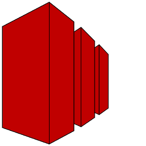

## Set up local cloud stacks with Docker Compose

#### Dependencies
- `docker`
- `docker-compose`

#### Content
This content is temporary (under development) and exemplary:
- Jupyter
- Minio
- Spark with Flask API (REST)
- Superset